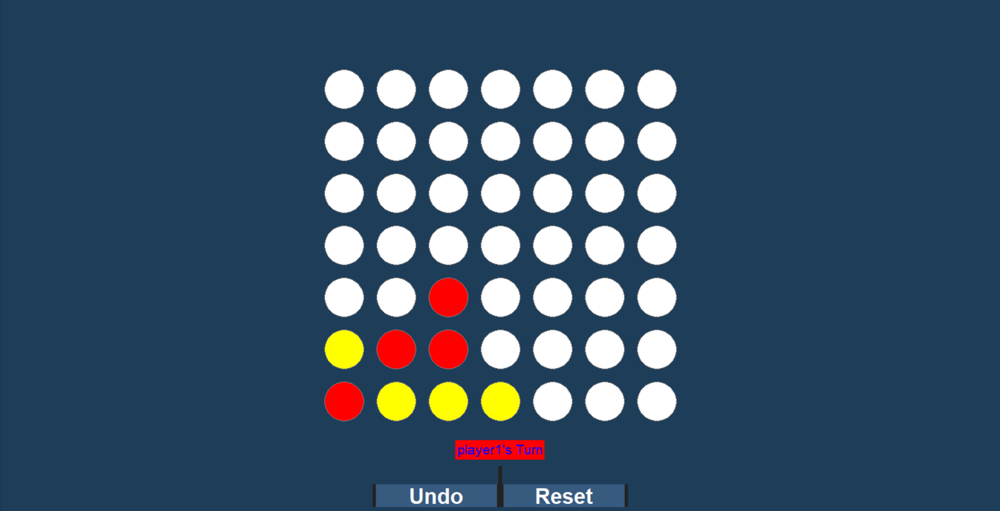
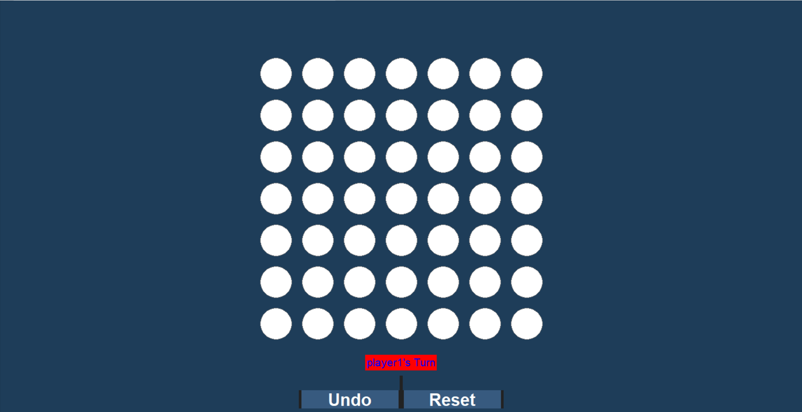

# 🎮 Connect 4 - GUI Game with Python, Tkinter & ttkbootstrap


A modern and interactive **Connect 4** game built in Python using **Tkinter** for the GUI and **ttkbootstrap** for a stylish dark theme. It features custom player names, hover effects, win detection, and a responsive user interface.

---

## 📸 Preview

| Image 1 | Image 2 |
|--------|---------|
|  |  |

---
## 💻 Data Structures Used

> A 2-D char array has been used to build the game board which allows players to make a move.

> The *Linear Search Algorithm* is used to check for win diagonally, horizontally or vertically.

> *Stack Data Structure* used to push and pop a move that has been made by a player.

> *Array* used to save the move history.


## 🧩 Features

- ✅ 7x7 Game Grid  
- ✅ Two Player Mode with Custom Names  
- ✅ Hover Preview Before Dropping Piece  
- ✅ Win Detection (Vertical, Horizontal, Diagonal)  
- ✅ Draw Detection  
- ✅ Reset Button to Restart the Game  
- ✅ Dark Theme using ttkbootstrap  
- ✅ Input Validation and User Feedback

---

## 🚀 Getting Started

### 🔧 Requirements

- Python 3.7 or higher
- `pip` package manager

### 📦 Installation

1. **Clone this repository**
   ```bash
   git clone https://github.com/your-username/connect4-gui.git
   cd connect4-gui
   ```

2. **Install dependencies**
   ```bash
   pip install -r requirements.txt
   ```

   _or manually:_
   ```bash
   pip install numpy ttkbootstrap
   ```

3. **Run the game**
   ```bash
   python game.py
   ```

---

## 🕹️ How to Play

1. Enter custom player names when prompted.
2. Player 1 uses **Red**, Player 2 uses **Yellow**.
3. Hover over a column to preview your move.
4. Click to drop your piece in the selected column.
5. The first player to connect four wins.
6. If the board fills up, it's a draw.
7. Click **Reset** to start a new game.

---

## 🗂️ Project Structure

```
connect4-gui/
├── game.py           # Main GUI application
├── board.py          # Game logic and win checks
├── piece.py          # Stack structure for each column
├── player.py         # Player class (name, number, color)
├── requirements.txt  # List of dependencies
└── README.md         # Project documentation
```

---

## 📥 Requirements

You can install requirements.txt:

```bash
pip install -r requirements.txt
```

---

## 💡 Future Improvements


- 🌐 Convert to a web app using Flask or Django

---

## 🤝 Contributing

Pull requests are welcome! For major changes, please open an issue first to discuss your ideas.  
To contribute:

1. Fork the repo  
2. Create a branch (`git checkout -b feature-branch`)  
3. Commit your changes (`git commit -m 'Add some feature'`)  
4. Push to the branch (`git push origin feature-branch`)  
5. Open a Pull Request  

---

## 📜 License

This project is licensed under the MIT License.  
See the [LICENSE](LICENSE) file for more info.

---

## 🙋‍♂️ contributors

1. Mona Elkhouly @MonaElkhouly
2. Rowida Mohammed @rowida117
3. Aya Emad @Aya423
4. Omar Gamal @OmarGamalH

---
